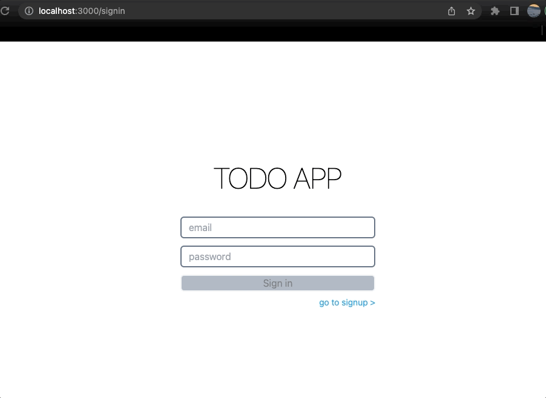
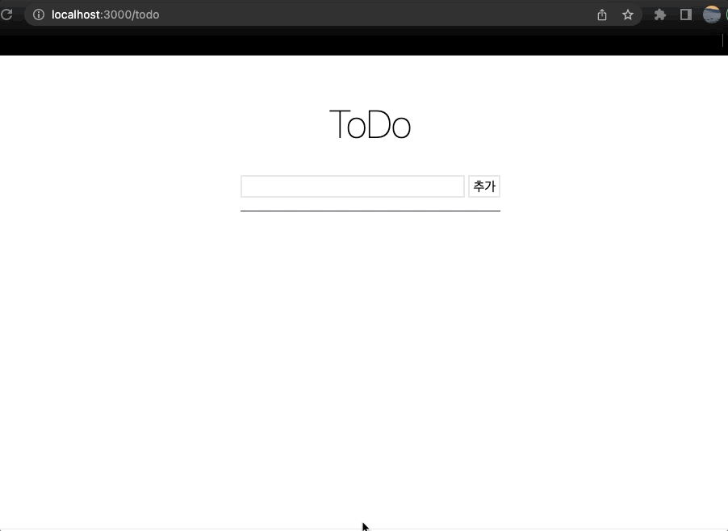

# wanted-pre-onboarding-frontend
원티드 프리온보딩 인턴쉽

## 실행방법
```
npm install && npm run start
```

## 시연영상


* Assignment 1 :
회원가입과 로그인 페이지에 이메일과 비밀번호의 유효성 검사기능을 구현
* Assignment 2 :
회원가입 페이지에서 버튼을 클릭 시 회원가입을 진행하고 회원가입이 정상적으로 완료되었을 시 /signin 경로로 이동
* Assignment 3 :
로그인 페이지에서 버튼을 클릭 시, 로그인을 진행하고 로그인이 정상적으로 완료되었을 시 /todo 경로로 이동
* Assignment 5 :
/todo경로에 접속하면 투두 리스트의 목록 확인




* Assignment 6 :
리스트 페이지에 새로운 TODO를 입력할 수 있는 input과 추가 button
* Assignment 7 :
TODO의 체크박스를 통해 완료 여부를 수정
* Assignment 8 :
TODO 우측에 수정버튼과 삭제 버튼
* Assignment 9 :
투두 리스트의 삭제 기능을 구현
* Assignment 4 :
로그인 여부에 따른 리다이렉트 처리를 구현